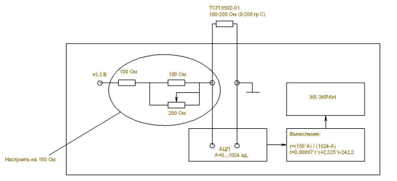

# temp_tsp_9502-01_measure_device
*this is device for measure temperarure of 4th termoresistors (100-200 Ohm)*

- It should be used TSP-9502001 termoresistors with this device.
## The temperature calculation is performed by the method below:
- it is gotten value of electric resistention

Вычисление температуры выполняется по формуле: t=0,00097*r*r+2,325*r-242,2
Формула обеспечивает точность ±0,2 гр С в диапазоне температур 0-200 гр С
(по отношению к данным таблицы для терморезистора ТСП 9502-01)

Общая точность откалиброванного устройства - ±2 гр С
В клеммы подключены калибровочные заглушки –
1- подстроечник 0-170 Ом , 2,3,4- 110 Ом

Предусмотрено 4 порога индикации:
50-100-150-200 градусов
